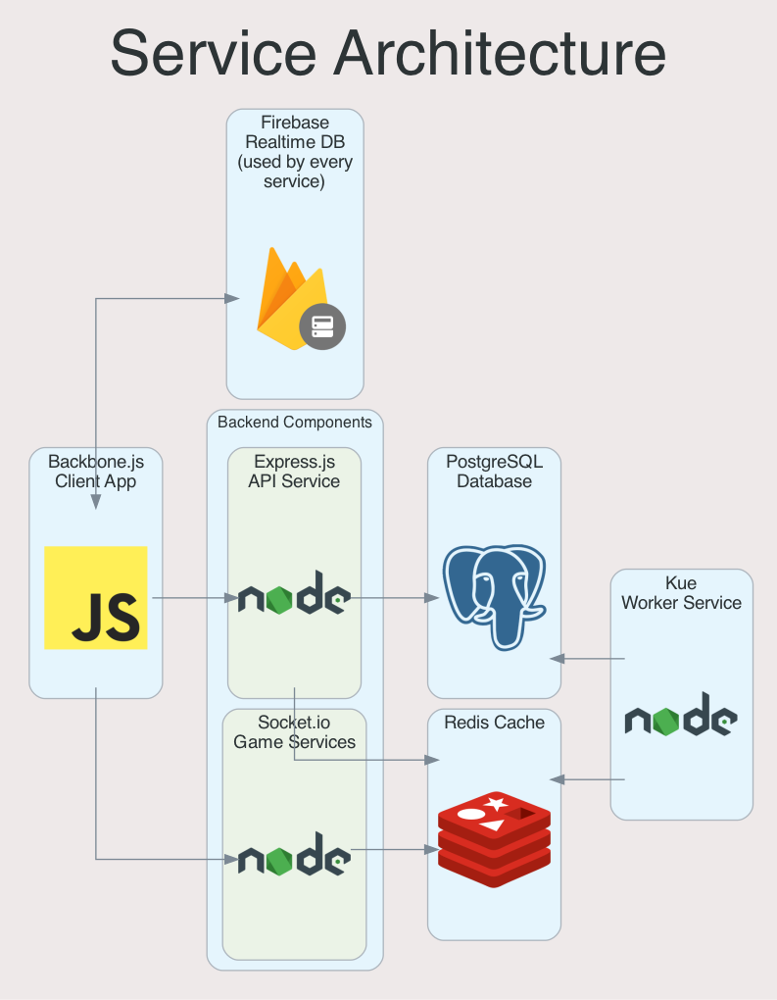

# Duelyst Service Architecture

## Client Architecture

The game client is a Backbone.js + Marionette application which runs in the
browser. Code can be found in `app/`, and configuration can be found in
`app/common/config.js`.

## Server Architecture

Duelyst's backend primarily consists of four CoffeeScript services:

API Server:

- The API server is an Express.js app which handles routes for game clients.
- The service stores user and game data in Postgres and Redis.
- The service listens on port 3000 by default, and it serves the browser client
	on the default route.
- Code can be found in `server/api.coffee`, and configuration can be found in
	`config/`.

Game Server:

- The Game server is a Socket.io WebSocket server which handles multiplayer
	games.
- The service enqueues tasks in Redis to be picked up by the workers.
- The service listens on port 8001 by default.
- Code can be found in `server/game.coffee`, and configuration can be found in
	`config/`.

Single Player (SP) Server:

- The SP server is a Socket.io WebSocket server which handles single-player
	games.
- The service enqueues tasks in Redis to be picked up by the workers.
- The service listens on port 8000 by default.
- Code can be found in `server/single_player.coffee`, and configuration can be
	found in `config/`.

Worker:

- The worker uses Kue to poll Redis-backed queues for tasks like game creation
	and matchmaking.
- Some matchmaking tasks also use Postgres, for server healthchecks and
	retrieving bot users.
- Code can be found in `worker/worker.coffee`, and configuration can be found
	in `config/`.
- A Kue GUI is available at `http://localhost:4000` via
	`docker compose up worker-ui`).

## Other Dependencies

Firebase Realtime Database:

- Provides a way to the game client to access both permanent and transient
	data, without direct access to Postgres, such as transmitting game steps.
- Client code can be found in `app` (see `new Firebase()` calls) and
	`server/lib/duelyst_firebase_module.coffee`, and configuration can be found
	in `config/`

Postgres:

- Stores relational data for users, completed games, database migrations, and
	more
- Client code can be found in `server/lib/data_access/knex.coffee` and
	`server/knexfile.js`, and configuration can be found in `config/`
- Migrations can be run via `docker compose up migrate`
- An admin UI is available at `http://localhost:8080` via
	`docker compose up adminer`

Redis:

- Used as a backing queue for Kue tasks, as well as for matchmaking, game
	management, player queues, and more
- Client code can be found in `server/redis/index.coffee`, and configuration
	can be found in `config/`

Consul:

- Not required in single-server deployments, but was historically used for
	service discovery, matchmaking, and spectating
- Client code can be found in `server/lib/consul.coffee`, and configuration can
	be found in `config/`

AWS S3:

- Provides binary large object (blob) storage for generic file storage.
- Not currently used, but code is available to use S3 for CDN, unfinished game
	archiving, client logging, and database backup features.

## Resource Utilization <a id="resource-utilization" />

The following resource utilization numbers were measured by Docker locally. The
baseline numbers were measured when idle, and the peak and per-game numbers
were measured when playing a practice game (which performs the same work as the
Game WebSocket server, plus computational work for AI decisions).

#### Node.js processes (API, Game, SP, Worker):

- CPU: 0-1% baseline; API spikes to 15-65% on loads; SP spikes to 5% on AI
	processing.
  - NOTE: The API spikes during loads are largely due to serving 75MB of static
		assets from Express instead of CDN.
- Memory: 300MB baseline. API increases to ~500MB over time.
- Network: Near-zero baseline.
	- API sends about 500KB per game.
	- Game and SP send about 200KB per game.
	- Worker's baseline is 1-2KB/s (internal, unbilled traffic).
		- This ongoing traffic is due to Kue polling; see
			`server/redis/r-jobs.coffee`.
- Storage: About 5GB (2.0GB for OS baseline, 1.3GB for `app/`, 0.8GB for
	`node_modules/`, 0.5GB for `dist/`)

#### Postgres database:

- CPU: Near-zero baseline. Reaches 7% on user retrieval (login etc.)
- Memory: 20MB baseline. Increases to 70MB after logging in and playing games
	(caching)
- Network: Near-zero baseline. Sends 10-15KB (internal, unbilled traffic) on
	user operations (fetching users, challenges, cards, etc.)
- Storage: About 1GB (0.5GB for OS baseline, 0.1GB for `/var/lib/postgresql`
	with ~5 users, ~20 games)

#### Redis cache:

- CPU: 1% baseline. Stays under 2% during games.
	- Redis 6.x has a second thread for connection handling, but we don't benefit
		much from this at our small scale.
- Memory: 4MB baseline; under 5MB when playing local single player.
- Network: 1KB/s baseline. Sends under 1MB per game (internal, unbilled
	traffic).
	- This ongoing traffic is due to Kue polling; see
		`server/redis/r-jobs.coffee`.
- Storage: Under 200MB.

#### Total resources used for 250 concurrent, 10-minute games (125 MP, 125 SP):

- vCPU: About 10 (Half of this is API and Worker)
- Memory: About 2GB (though more will improve buffer/cache efficiency)
- Network: About 300 KB/s overall; 175MB total for 250 games (700KB per game)
- Storage: About 22GB with each service on a different instance.
